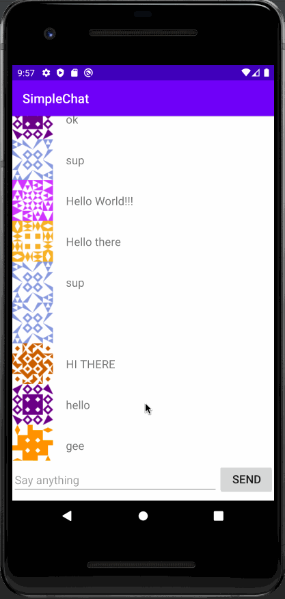

# *SimpleChat*

**SimpleChat** is an android app that allows a user to chat with other users, saving messages in Parse

## User Stories

The following **required** functionality is completed:

* [X] Connected with the Parse database
* [X] Created basic chat layout with an EditText, Button, and RecyclerView
* [X] User is logged in as an anonymous user in Parse
* [X] Messages are saved to the Parse database
* [X] Toast appears when a message is saved 
* [X] RecyclerView and Adapter are used to show all the messages in the database
* [X] Messages are continually refreshed with live queries

## Video Walkthroughs

Here is a general walkthrough of these user stories 

## License

    Copyright [2020] [Anna Zhang]

    Licensed under the Apache License, Version 2.0 (the "License");
    you may not use this file except in compliance with the License.
    You may obtain a copy of the License at

        http://www.apache.org/licenses/LICENSE-2.0

    Unless required by applicable law or agreed to in writing, software
    distributed under the License is distributed on an "AS IS" BASIS,
    WITHOUT WARRANTIES OR CONDITIONS OF ANY KIND, either express or implied.
    See the License for the specific language governing permissions and
    limitations under the License.